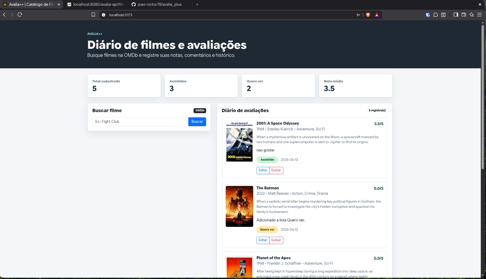
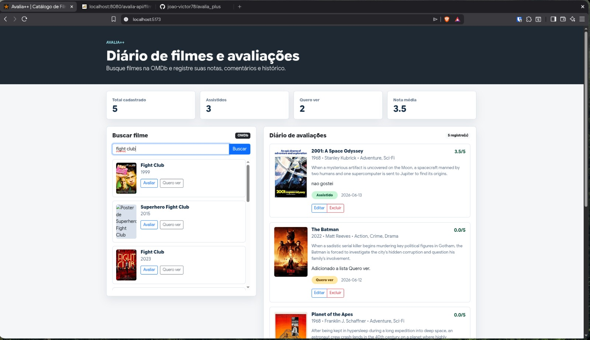
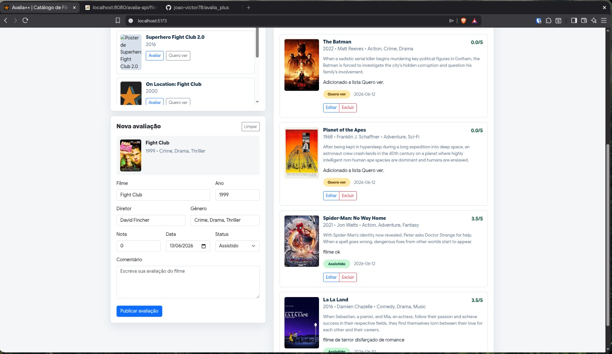
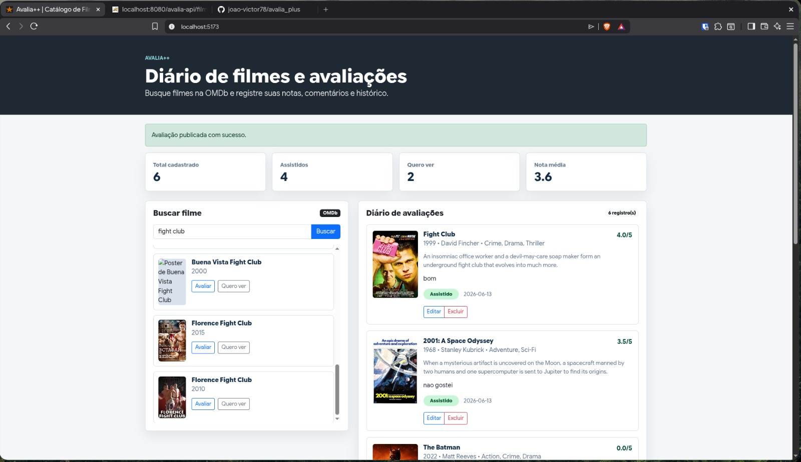
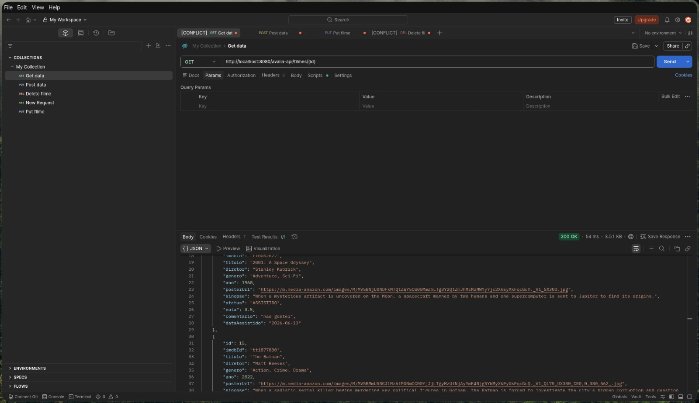
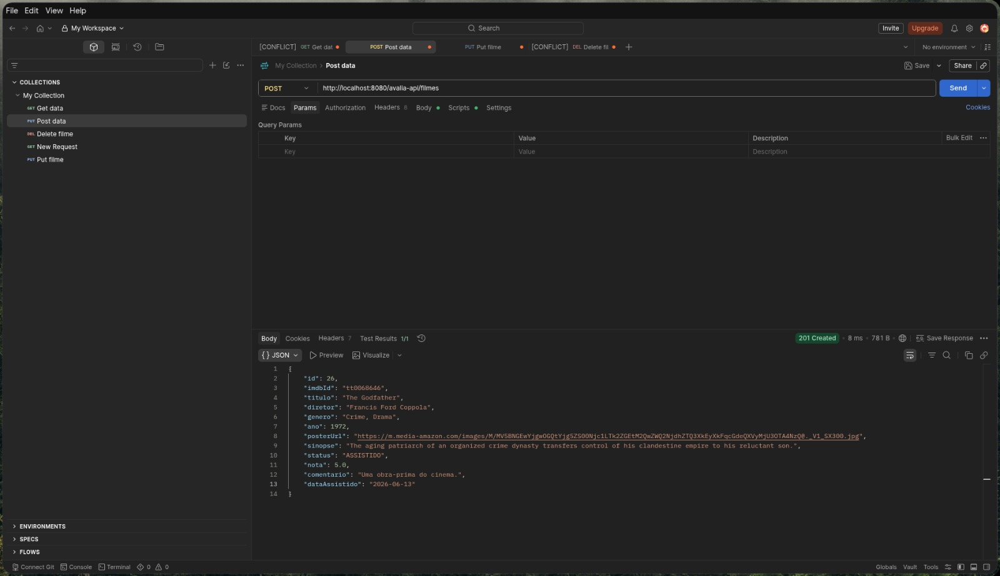
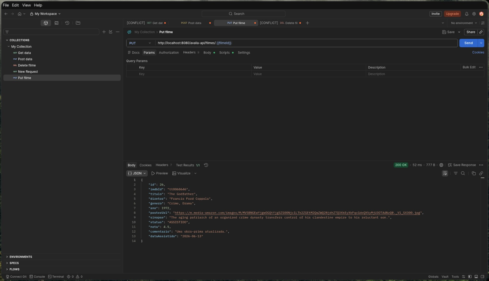
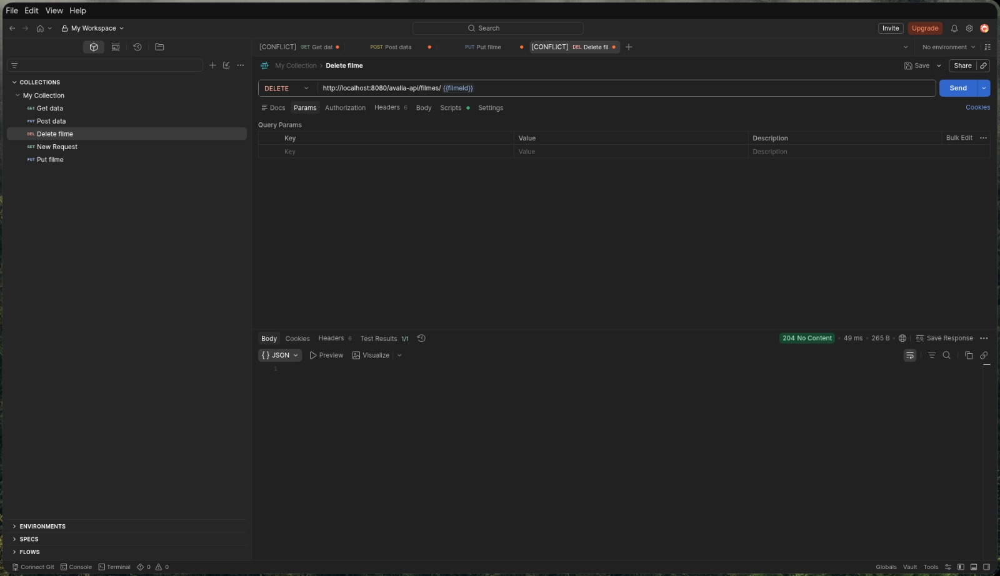

# Avalia++

## Aluno

- João Victor Alves da Mota

## Tema escolhido

Diário de filmes e avaliações, inspirado no Letterboxd.

## Descrição da aplicação

O Avalia++ é uma aplicação web para pesquisar filmes pela API OMDb, registrar avaliações pessoais e criar uma lista de filmes para assistir posteriormente.

Os dados são enviados pelo front-end React para uma API Java e armazenados em um banco PostgreSQL. A aplicação permite cadastrar, listar, editar e excluir registros, além de apresentar contadores e a média das avaliações.

## Tecnologias utilizadas

- Front-end: React, Vite, TypeScript e Bootstrap;
- Back-end: Java 17, Jakarta Servlets, JDBC, DAO, ConnectionFactory e Gson;
- Banco de dados: PostgreSQL;
- Servidor: Apache Tomcat;
- Gerenciadores de build: npm e Maven;
- API externa: OMDb.

## Como criar o banco de dados

Com o PostgreSQL instalado e em execução, rode na raiz do projeto:

```bash
psql -U postgres -f database/schema.sql
```

O script cria o banco `avalia_plus`, a tabela `filmes` e registros iniciais.

Por padrão, o back-end utiliza:

```text
URL: jdbc:postgresql://localhost:5432/avalia_plus
Usuário: postgres
Senha: postgres
```

As credenciais podem ser alteradas pelas variáveis `DB_URL`, `DB_USER` e `DB_PASSWORD`.

## Como rodar o back-end

Entre na pasta do back-end e gere o arquivo WAR:

```bash
cd backend
mvn clean package
```

Publique o arquivo `backend/target/avalia-api.war` no Apache Tomcat.

A API ficará disponível em:

```text
http://localhost:8080/avalia-api/filmes
```

## Como rodar o front-end

Na raiz do projeto, instale as dependências:

```bash
npm install
```

Crie um arquivo `.env` baseado no `.env.example`:

```env
VITE_API_URL=http://localhost:8080/avalia-api/filmes
VITE_OMDB_API_KEY=sua_chave_da_omdb
```

Inicie o Vite:

```bash
npm run dev
```

Acesse:

```text
http://localhost:5173
```

## Arquitetura

O front-end foi dividido em componentes React, interfaces TypeScript e serviços responsáveis pelas requisições HTTP.

O back-end utiliza:

- `FilmeServlet` para os endpoints REST;
- `FilmeDAO` para as operações de CRUD;
- `ConnectionFactory` para a conexão com o PostgreSQL;
- `CorsFilter` para permitir a comunicação entre React e Java;
- `Filme` como classe de modelo.

## Endpoints

| Método | Endpoint | Operação |
|---|---|---|
| `GET` | `/avalia-api/filmes` | Lista os registros |
| `GET` | `/avalia-api/filmes/{id}` | Busca pelo ID |
| `POST` | `/avalia-api/filmes` | Cadastra um registro |
| `PUT` | `/avalia-api/filmes/{id}` | Atualiza um registro |
| `DELETE` | `/avalia-api/filmes/{id}` | Exclui um registro |

## Prints da aplicação

### Tela principal



### Busca de filmes na OMDb



### Formulário de avaliação



### Avaliação publicada



## Testes da API no Postman

### Listagem de registros - GET



### Cadastro de registro - POST



### Atualização de registro - PUT



### Exclusão de registro - DELETE



## Vídeo explicativo

Adicionar o link público do vídeo de 3 a 5 minutos.
